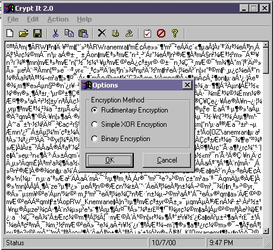



## Crypt It 2\.0

### Description

Crypt It 2.0 helps you to encrypt your valuable data so that no one can hack it ! It has three methods of encryption for you. You can choose what method you want to use. The password for the program can be changed too.
 
### More Info
 

             |
---                |---
**Submitted On**   |2000-10-07 21:37:36
**By**             |[Md Emran Hasan](https://github.com/Planet-Source-Code/PSCIndex/blob/master/ByAuthor/md-emran-hasan.md)
**Level**          |Advanced
**User Rating**    |4.5 (100 globes from 22 users)
**Compatibility**  |VB 3\.0, VB 4\.0 \(16\-bit\), VB 4\.0 \(32\-bit\), VB 5\.0, VB 6\.0
**Category**       |[Encryption](https://github.com/Planet-Source-Code/PSCIndex/blob/master/ByCategory/encryption__1-48.md)
**World**          |[Visual Basic](https://github.com/Planet-Source-Code/PSCIndex/blob/master/ByWorld/visual-basic.md)
**Archive File**   |[CODE\_UPLOAD1056110102000\.zip](https://github.com/Planet-Source-Code/md-emran-hasan-crypt-it-2-0__1-11978/archive/master.zip)

